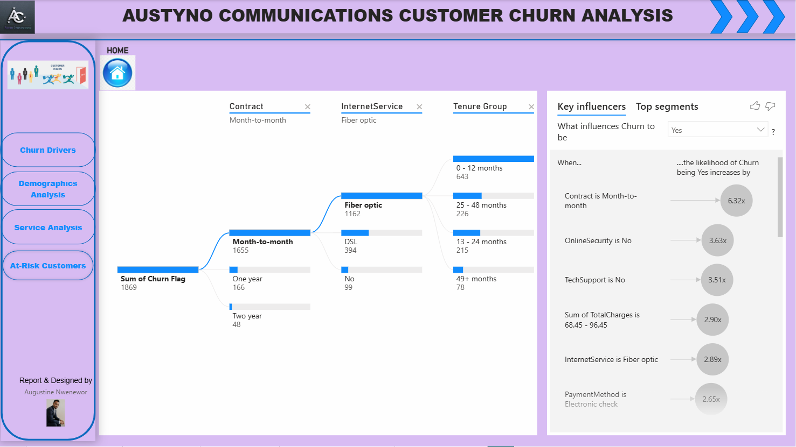
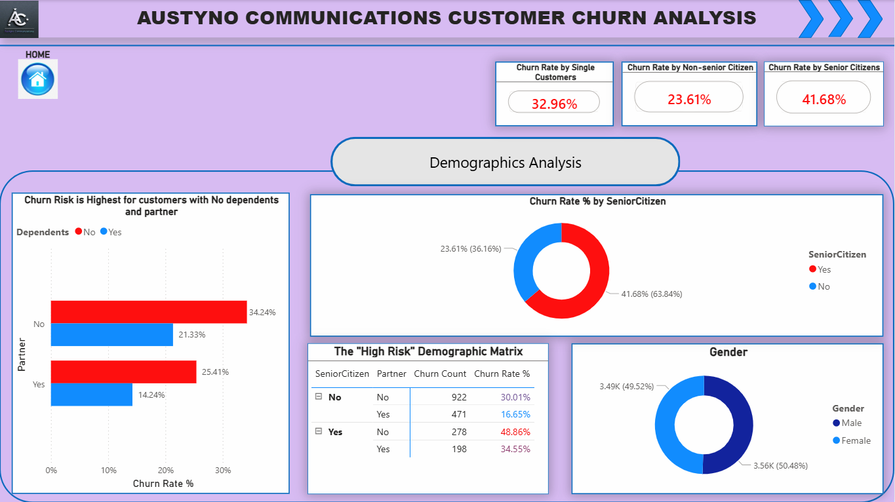
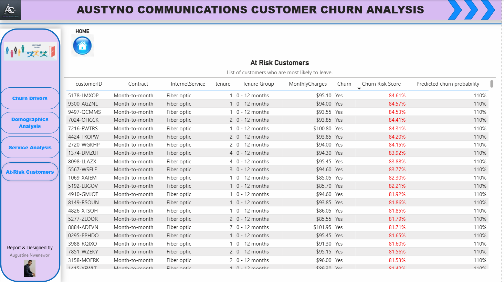

# Telco Customer Churn Analysis

📌 Project Overview

In the telecommunications industry, customer retention is critical. Acquiring a new customer is significantly more expensive than retaining an existing one. This project analyzes a dataset of 7,000+ customers to identify why customers are leaving ("churning") and provides actionable recommendations to reduce attrition.

Live Dashboard: [Click here to view the live dashboard](https://app.powerbi.com/links/A7rFY2LeHI?ctid=21abb5bf-31bc-4c74-a5bd-25e3727b8d91&pbi_source=linkShare) 

❓ Problem Statement

The company is facing a 26.5% churn rate, resulting in significant revenue loss. The goal of this analysis is to:

- Identify the key demographics and behaviors of customers who churn.

- Determine which services or contract types are driving customers away.

- Predict high-risk customers using a Machine Learning score.

- Provide data-driven strategies to improve retention.

🛠️ Tools & Technologies Used

- Power BI: For interactive dashboards, DAX calculations, and data visualization.
- Python (Scikit-Learn): For data preprocessing and building a Logistic Regression model to calculate "Churn Risk Scores."
- Power Query: For ETL (Extract, Transform, Load) processes and data cleaning.

📂 Data Description

The dataset contains 7,043 records with 21 attributes, including:
- Demographics: Gender, Senior Citizen, Partner, Dependents.
- Services: Phone, Multiple Lines, Internet (DSL/Fiber), Security, Backup, etc.
- Account Info: Contract Type, Payment Method, Monthly Charges, Tenure.
- Target Variable: Churn (Yes/No).

⚙️ Methodology

1. Data Cleaning & Transformation
- Handled missing values in the TotalCharges column.
- Converted Churn (Yes/No) to a binary column (1/0) for calculation.
- Created specific age and tenure groups for better segmentation.

2. Machine Learning Integration
- Used Python to train a Logistic Regression model on the dataset.
- Generated a "Churn Risk Score" (0% - 100%) for each customer to identify "at-risk" individuals before they leave.

3. DAX Calculations
- Key measures created for the dashboard:
- Churn Rate % = DIVIDE([Churn Count], [Total Customers])
- Monthly Revenue Loss = CALCULATE(SUM(MonthlyCharges), Churn="Yes")
- Avg Churn Risk Score = AVERAGE(Churn Risk Score)

💡 Key Insights

1. Contract Type is the #1 Driver:
- Customers on Month-to-Month contracts have an alarmingly high churn rate compared to those on 1 or 2-year contracts.

Recommendation: Incentivize customers to switch to yearly contracts by offering a small discount or free add-on services.

2. The "Fiber Optic" Problem
- Fiber Optic users churn at a much higher rate than DSL users, despite paying more.

Recommendation: Investigate service quality (outages, speed) for Fiber users immediately.

3. Payment Method Friction
- Customers paying via Electronic Check represent a disproportionate amount of churn.

Recommendation: Encourage automatic payments (Credit Card/Bank Transfer) by highlighting convenience and reliability.

4. The First Year "Danger Zone"
Churn is highest within the first 12 months of tenure.

Recommendation: Implement a specialized "New Customer Onboarding" program to engage users early.

📸 Dashboard Screenshots

2. , 2. Demographics Page, 3. Service Detail Page)

🚀 Conclusion
This analysis provides a clear roadmap for reducing churn. By targeting month-to-month Fiber Optic users with better contract offers and fixing the friction in Electronic Check payments, the company could potentially save $139.13k annually.
